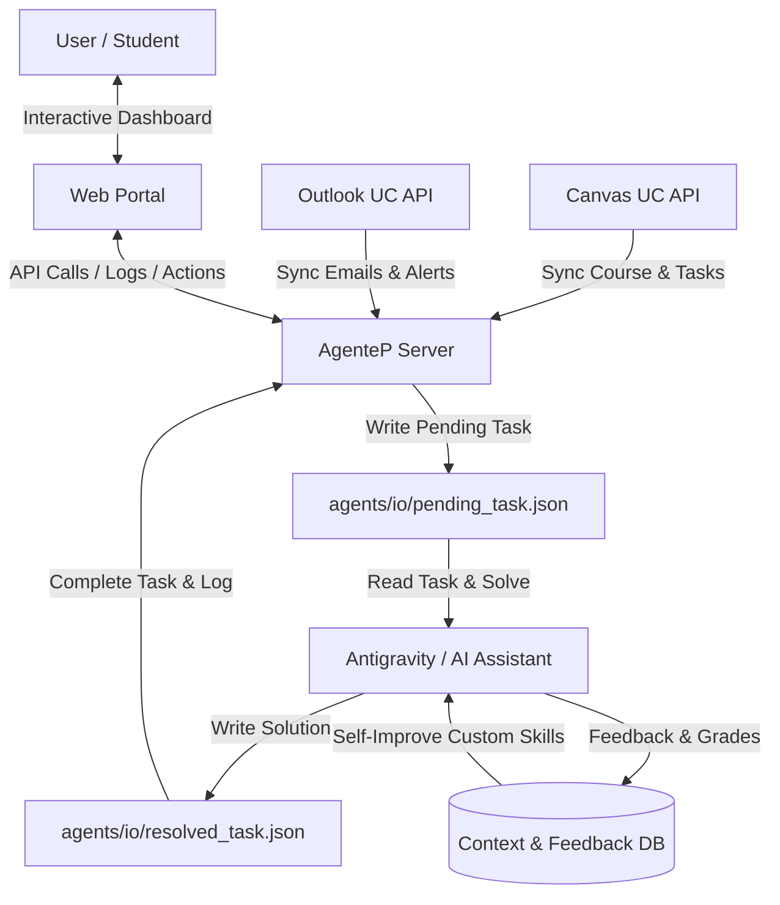

# AgenteP: Autonomous University Agent Portal

An AI-driven portal designed to automate, manage, and assist with academic life at **Pontificia Universidad Católica (UC)** by integrating university platforms (Canvas UC and Outlook) with autonomous background agents that execute tasks, manage study flows, and self-improve over time.

---

## 👁️ Project Vision
The goal of **AgenteP** is to build a personal server-side agentic ecosystem. It runs 24/7 on a local server or VPS, continuously syncing with university APIs, planning study tasks, drafting homework/assignments, and self-refining its performance. 

Just like developer agents learn from PR reviews and code corrections, **AgenteP** will learn from university grading feedback, teacher corrections, syllabus guidelines, and direct user reviews to continuously improve its academic output.

---

## 🏛️ Architectural Overview

---

## 🔑 Key Features

### 1. Unified Academic Dashboard
*   **Active Courses (Ramos):** View all enrolled classes, current grades, and syllabus objectives.
*   **Task Board (Issues/Kanban):** Automatically translates Canvas assignments and Outlook announcements into interactive "Issues" or tasks.
*   **Live Agent Monitor:** Real-time log streaming of what background agents are reading, planning, and executing.

### 2. Deep Integrations
*   **Canvas UC REST API:** Syncs courses, calendars, assignments, submissions, and grading comments/rubrics.
*   **Outlook Email & Calendar:** Analyzes emails from professors to extract unexpected schedule changes, class cancellations, or task modifications.

### 3. Server-Side Autonomous Agents & Task Solvers
*   **Drafting & Review Workflow:** The local worker formats Canvas assignments (e.g. programming homework, report drafting) into JSON files. Antigravity (the coding assistant) solves them locally and writes back the solution, uploading them as "Drafts" in the web dashboard for user inspection and manual edit.
*   **Class Material Summarizer:** Automatically processes files, slides, PDFs, or lecture notes uploaded to Canvas courses to generate concise, highly readable summaries of class topics as they are published.
*   **Execution Sandbox:** Safe local environments for the agent to run and test code before presenting solutions.

### 4. Self-Programming & Evolutionary Context
*   **Grading Feedback Sync:** The system automatically extracts professor feedback from Canvas grading comments and feeds it back into the agent's memory.
*   **Stylistic & Preferences Context:** Learns from teacher preferences, previous high-scoring reports, and user-guided corrections to adjust its prompt and execution strategy automatically.

---

## 🗺️ Implementation Roadmap

### Phase 1: Core Integration & Backend Server
*   [x] Set up the backend server (FastAPI/Python).
*   [ ] Connect and authenticate with the **Canvas UC API** (using developer/access tokens).
*   [ ] Set up an **Outlook parser** to fetch and digest relevant emails.
*   [ ] Design the database schema (SQLite or PostgreSQL) to store courses, assignments, agent runs, and learning context.

### Phase 2: Web Portal Dashboard (Premium UI/UX)
*   [ ] Create a modern, high-fidelity responsive frontend dashboard (using React/Vite).
*   [ ] Implement a unified Kanban or List view of Canvas assignments ("Issues").
*   [ ] Add an "Agent Command Center" where the user can view logs, review agent drafts, and write feedback.

### Phase 3: Autonomous Task Agent & Sandbox Execution
*   [x] Build the local bridge workflow that formats tasks and delegates LLM reasoning to the coding assistant (Antigravity).
*   [ ] Implement a secure local runner (Docker or micro-sandbox) for the agent to run code, compile documents, or search resources.
*   [ ] Create the review workflow: "Draft -> Human Review -> Modify -> Submit".

### Phase 4: Self-Programming & Evolutionary Context
*   [ ] Implement a feedback digestion pipeline that processes Canvas grading comments and rubrics.
*   [ ] Build the prompt/skill auto-updater: Configure skills inside `.agents/skills` that Antigravity reads and self-refines based on Canvas grading comments and class guidelines.
